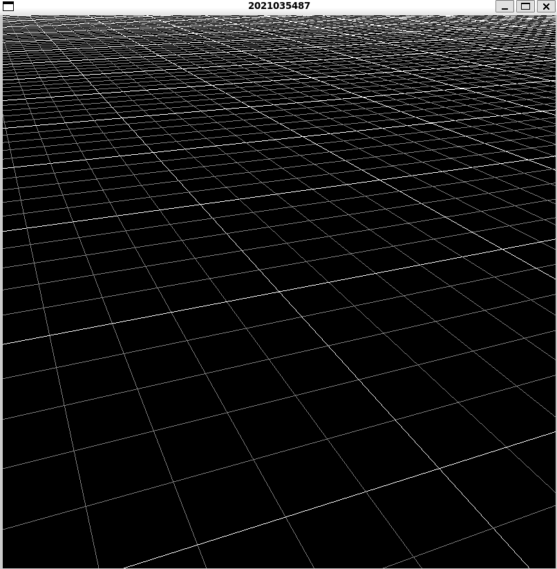

[Home](../README.md)

# Project1 - Basic OpenGL viewer

## 1. Requirements I implemented

1. orbit
    1. 구면좌표계의 식을 이용해 카메라의 eye vector를 변경
2. pan
    1. 카메라의 u, v 벡터를 lookAt matrix로부터 얻은 뒤 그 방향들로 카메라 위치를 이동시킴
3. zoom
    1. 스크롤 시 distance를 변경해 카메라의 eye와 target 사이의 거리가 변하게 함
    2. orthogonal view에서도 zoom 효과를 적용하기 위해 glm.orthogonal의 left, right, bottom, top에 distance를 인자로 사용함
4. 기타
    1. 바닥의 grid는 main.py 78줄의 num_of_lines 값을 조정해 개수를 변경 가능하고, 각 줄의 간격은 1이며 5번째 줄마다 색이 진하게 표시되도록 함

## 2. Screenshots.

perspective view 1

perspective view 2

orthogonal view