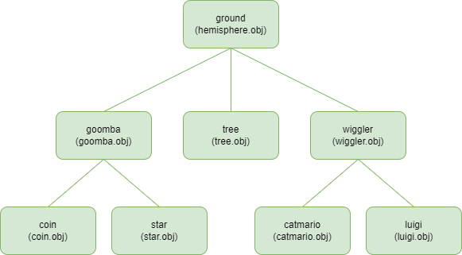

[Home](../README.md)

# Project2 - Obj viewer & drawing a hierarchical model

## 1. Requirements I Implemented

1. single mesh rendering mode
    1. dropg-and-drop으로 obj파일 로드 후 render
    2. 한번에 하나의 mesh만 render
    3. print obj file info (animating hierarchical mode 에서는 출력하지 않음, drag-and-drop할때만 출력)
2. animating hierarchical model rendering mode
    1. h 키를 누르면 모드 전환, 다시 h를 누르면 single mesh rendering mode로 돌아감
    2. 제출 폴더에서 python main.py로 실행하면 자동으로 animating에 사용될 파일들을 로드
    3. os.path.join()을 사용해 platform-indenpendet하게 파일을 로드할 수 있도록 함
    4. 각 오브젝트들의 구조는 다음과 같음
        1. 참고:  [wiggler(꽃충이) 이미지](https://encrypted-tbn0.gstatic.com/images?q=tbn:ANd9GcS7d7jtJBKKzseRTtSsbhr2SlPLCPjO4ThJHg&usqp=CAU)
        
        
        
3. Lighting & Etc
    1. Phong illumination과 phong shading을 사용해 render
    2. light는 3개가 존재 ⇒ (100,100,100), (-100,100,-100), (0,-100,0)
    3. 각 light마다 최종 color를 구하고 최종 color의 rgb값은 다음과 같은 코드로 결정함
        
        ```c
        vec3 result_color = calculate_shading(lights[0]);
            
            for (int i = 1; i < NLIGHT; i++) {
                vec3 color = calculate_shading(lights[i]);
                
                if (result_color.x < color.x) result_color.x = color.x;
                if (result_color.y < color.y) result_color.y = color.y;
                if (result_color.z < color.z) result_color.z = color.z;
            }
        ```
        
    4. z 버튼을 누르면 wireframe mode와 solid mode를 toggle

# 2. Hyperlink To The Video

[animating hierarchical rendering](https://www.youtube.com/shorts/JKOhAU9QfKo)